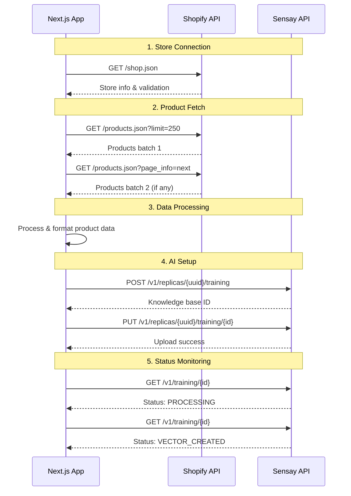
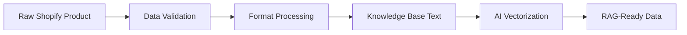

# Segmante - API Documentation & Integration Guide

<div align="center">


**Comprehensive API Reference for Enterprise E-commerce AI Integration**

</div>

---

## 🎯 **API Overview**

Segmante leverages two primary API ecosystems to deliver intelligent conversational commerce: **Sensay AI Platform** for advanced artificial intelligence capabilities and **Shopify Admin API** for comprehensive e-commerce data management. This documentation provides complete integration specifications, authentication protocols, and practical implementation examples.

---

## 🤖 **Sensay AI Platform API**

The Sensay AI Platform provides the core AI intelligence for Segmante through various REST endpoints.

### **Base Configuration**

```typescript
const sensayClient = new VerboseSensayAPI({
  HEADERS: {
    'X-ORGANIZATION-SECRET': process.env.NEXT_PUBLIC_SENSAY_API_KEY_SECRET,
    'X-USER-ID': 'sample-user', // Optional for user-specific operations
    'X-API-Version': '2025-03-25'
  }
});
```

**Base URL:** `https://api.sensay.io`

---

### **1. User Management**

#### **Check User Existence**
```http
GET /v1/users/{userID}
```

**Headers:**
- `X-ORGANIZATION-SECRET`: Your organization API key
- `X-API-Version`: 2025-03-25

**Response:**
```json
{
  "success": true,
  "name": "Sample User",
  "id": "sample-user",
  "linkedAccounts": []
}
```

#### **Create User**
```http
POST /v1/users
```

**Request Body:**
```json
{
  "id": "sample-user",
  "name": "Sample User"
}
```

**Response:**
```json
{
  "success": true,
  "id": "sample-user",
  "name": "Sample User",
  "created_at": "2025-09-24T17:04:55.749157+00:00"
}
```

---

### **2. Replica Management**

#### **List User Replicas**
```http
GET /v1/replicas
```

**Headers:**
- `X-ORGANIZATION-SECRET`: Your organization API key
- `X-USER-ID`: User identifier
- `X-API-Version`: 2025-03-25

**Query Parameters:**
- `page_index`: 1 (default)
- `page_size`: 24 (default)
- `sort`: name (default)

**Response:**
```json
{
  "success": true,
  "type": "array",
  "items": [
    {
      "uuid": "220a74e5-6804-4f4e-8fea-be25162ed8c4",
      "name": "Shopify Product Assistant",
      "slug": "shopify-assistant-1234567890-abc123",
      "short_description": "AI assistant for Shopify product management",
      "greeting": "Hello! I'm your Shopify product assistant...",
      "owner_uuid": "274fac7f-639e-41aa-bb36-0e4479b98c92",
      "created_at": "2025-09-24T17:04:55.749157+00:00",
      "llm": {
        "model": "claude-3-7-sonnet-latest",
        "memoryMode": "rag-search",
        "systemMessage": "You are an intelligent AI assistant..."
      }
    }
  ],
  "total": 1
}
```

#### **Create Replica**
```http
POST /v1/replicas
```

**Request Body:**
```json
{
  "name": "Shopify Product Assistant",
  "shortDescription": "An AI assistant specialized in Shopify product management",
  "greeting": "Hello! I'm your Shopify product assistant...",
  "slug": "shopify-assistant-1234567890-abc123",
  "ownerID": "sample-user",
  "llm": {
    "model": "claude-3-7-sonnet-latest",
    "memoryMode": "rag-search",
    "systemMessage": "You are an intelligent AI assistant specialized in Shopify product management..."
  }
}
```

**Response:**
```json
{
  "success": true,
  "uuid": "220a74e5-6804-4f4e-8fea-be25162ed8c4",
  "name": "Shopify Product Assistant",
  "slug": "shopify-assistant-1234567890-abc123",
  "created_at": "2025-09-24T17:04:55.749157+00:00"
}
```

---

### **3. Knowledge Base Management**

#### **Create Training Entry**
```http
POST /v1/replicas/{replicaUUID}/training
```

**Headers:**
- `X-ORGANIZATION-SECRET`: Your organization API key
- `X-USER-ID`: User identifier
- `X-API-Version`: 2025-03-25

**Response:**
```json
{
  "success": true,
  "knowledgeBaseID": 181127
}
```

#### **Upload Training Data**
```http
PUT /v1/replicas/{replicaUUID}/training/{trainingID}
```

**Request Body:**
```json
{
  "rawText": "# Shopify Store Product Catalog\n\nThis knowledge base contains detailed information...\n\n## Product Information\n\n..."
}
```

**Response:**
```json
{
  "success": true
}
```

#### **Check Training Status**
```http
GET /v1/training/{trainingID}
```

**Response:**
```json
{
  "success": true,
  "id": 181127,
  "replica_uuid": "220a74e5-6804-4f4e-8fea-be25162ed8c4",
  "type": "text",
  "status": "VECTOR_CREATED",
  "raw_text": "# Shopify Store Product Catalog...",
  "title": null,
  "description": "This document provides a detailed catalog of products...",
  "created_at": "2025-09-24T18:30:03.443452+00:00",
  "updated_at": "2025-09-24T18:31:02.857639+00:00"
}
```

**Status Values:**
- `BLANK`: Initial state
- `PROCESSING`: Data being processed and vectorized
- `VECTOR_CREATED`: Ready for RAG queries
- `ERROR`: Processing failed

---

### **4. Chat Completions**

#### **Standard Chat Completion**
```http
POST /v1/replicas/{replicaUUID}/chat/completions
```

**Headers:**
- `X-ORGANIZATION-SECRET`: Your organization API key
- `X-USER-ID`: User identifier
- `X-API-Version`: 2025-03-25

**Request Body:**
```json
{
  "content": "What snowboards do you have in stock and what are their prices?",
  "source": "web",
  "skip_chat_history": false
}
```

**Response:**
```json
{
  "success": true,
  "content": "I have several snowboards currently in stock:\n\n1. The Multi-managed Snowboard - $629.95 (100 units available)\n2. The Multi-location Snowboard - $729.95 (100 units available)..."
}
```

---

## 🛍️ **Shopify Admin API**

The Shopify Admin API provides access to store data including products, inventory, and shop information.

### **Base Configuration**

```typescript
const shopifyClient = axios.create({
  baseURL: `https://${storeDomain}/admin/api/2023-10`,
  headers: {
    'X-Shopify-Access-Token': accessToken,
    'Content-Type': 'application/json'
  },
  timeout: 30000
});
```

**Base URL Pattern:** `https://{store-name}.myshopify.com/admin/api/2023-10`

---

### **1. Store Information**

#### **Get Shop Details**
```http
GET /admin/api/2023-10/shop.json
```

**Headers:**
- `X-Shopify-Access-Token`: Your private app access token

**Response:**
```json
{
  "shop": {
    "id": 123456789,
    "name": "Sensay Segmante Store",
    "domain": "sensay-segmante.myshopify.com",
    "email": "store@example.com",
    "created_at": "2023-01-15T10:00:00-05:00",
    "updated_at": "2025-09-24T14:30:00-05:00",
    "country_code": "US",
    "currency": "USD",
    "timezone": "America/New_York",
    "plan_name": "basic",
    "plan_display_name": "Basic Shopify"
  }
}
```

---

### **2. Product Management**

#### **Get All Products**
```http
GET /admin/api/2023-10/products.json
```

**Query Parameters:**
- `limit`: 250 (max, default: 50)
- `page_info`: For pagination
- `status`: active, archived, draft (default: active)

**Response:**
```json
{
  "products": [
    {
      "id": 10739648266543,
      "title": "The Complete Snowboard",
      "body_html": "<p>This PREMIUM snowboard is so SUPERDUPER awesome!</p>",
      "vendor": "Snowboard Vendor",
      "product_type": "snowboard",
      "created_at": "2025-09-06T12:00:00-04:00",
      "updated_at": "2025-09-25T08:15:00-04:00",
      "published_at": "2025-09-06T12:00:00-04:00",
      "tags": "Premium, Snow, Snowboard, Sport, Winter",
      "variants": [
        {
          "id": 48739648299311,
          "product_id": 10739648266543,
          "title": "Ice",
          "price": "699.95",
          "compare_at_price": null,
          "sku": "",
          "inventory_quantity": 10,
          "inventory_management": "shopify",
          "option1": "Ice",
          "option2": null,
          "option3": null,
          "weight": 0.0,
          "weight_unit": "g"
        }
      ],
      "images": [
        {
          "id": 48739648332079,
          "product_id": 10739648266543,
          "src": "https://cdn.shopify.com/s/files/1/0123/4567/8901/products/snowboard.jpg"
        }
      ]
    }
  ]
}
```

#### **Get Product Count**
```http
GET /admin/api/2023-10/products/count.json
```

**Response:**
```json
{
  "count": 21
}
```

---

### **3. Inventory Management**

#### **Get Inventory Levels**
```http
GET /admin/api/2023-10/inventory_levels.json
```

**Query Parameters:**
- `inventory_item_ids`: Comma-separated list of inventory item IDs
- `location_ids`: Comma-separated list of location IDs
- `limit`: 250 (max, default: 50)

**Response:**
```json
{
  "inventory_levels": [
    {
      "inventory_item_id": 48739648299311,
      "location_id": 123456789,
      "available": 10,
      "updated_at": "2025-09-24T15:30:00-04:00"
    }
  ]
}
```

---

## 🔄 **Integration Flow Examples**

### **Complete Product Sync Flow**



---

## 🔒 **Authentication & Security**

### **Sensay AI Authentication**

```typescript
// Organization-level authentication
const orgHeaders = {
  'X-ORGANIZATION-SECRET': 'your_api_key_here',
  'X-API-Version': '2025-03-25'
};

// User-specific authentication
const userHeaders = {
  'X-ORGANIZATION-SECRET': 'your_api_key_here',
  'X-USER-ID': 'sample-user',
  'X-API-Version': '2025-03-25'
};
```

### **Shopify Authentication**

```typescript
// Private app access token
const shopifyHeaders = {
  'X-Shopify-Access-Token': 'shpat_your_token_here',
  'Content-Type': 'application/json'
};
```

### **Security Best Practices**

- ✅ Store API keys in environment variables
- ✅ Use server-side API calls to prevent CORS
- ✅ Validate all input data with schemas
- ✅ Implement proper error handling
- ✅ Monitor API rate limits
- ❌ Never expose API keys in client-side code
- ❌ Don't store sensitive tokens in version control

---

## 📊 **Data Transformation**

### **Product Data Pipeline**



### **Transformation Example**

**Input (Shopify Product):**
```json
{
  "id": 10739648266543,
  "title": "The Complete Snowboard",
  "body_html": "<p>This PREMIUM snowboard is so SUPERDUPER awesome!</p>",
  "variants": [
    {
      "id": 48739648299311,
      "title": "Ice",
      "price": "699.95",
      "inventory_quantity": 10
    }
  ]
}
```

**Output (Processed for AI):**
```markdown
## The Complete Snowboard

**Product ID:** 10739648266543
**Vendor:** Snowboard Vendor
**Product Type:** snowboard
**SKU:** Not specified

**Description:**
This PREMIUM snowboard is so SUPERDUPER awesome!

**Pricing & Variants:**
  • Ice: $699.95 - 10 in stock

**Inventory Status:**
- Total Available: 10
- Inventory Tracked: Yes

**Categories & Tags:**
Premium, Snow, Snowboard, Sport, Winter
```

---

## 🚨 **Error Handling**

### **Common Error Responses**

#### **Sensay API Errors**
```json
{
  "success": false,
  "error": "Unauthorized",
  "fingerprint": "2be4e71b940641d387f07e5efafbb9e3",
  "request_id": "sin1::dhl8b-1758738412133-dd4ce6f27ad1"
}
```

#### **Shopify API Errors**
```json
{
  "errors": {
    "base": ["Invalid API key or access token"]
  }
}
```

### **Error Code Reference**

| Status | Sensay AI | Shopify | Description |
|--------|-----------|---------|-------------|
| 400 | Bad Request | Bad Request | Invalid request format |
| 401 | Unauthorized | Unauthorized | Invalid API key/token |
| 403 | Forbidden | Forbidden | Insufficient permissions |
| 404 | Not Found | Not Found | Resource doesn't exist |
| 429 | Too Many Requests | Too Many Requests | Rate limit exceeded |
| 500 | Internal Server Error | Internal Server Error | Server error |

---

## 🔍 **Testing & Debugging**

### **API Testing Commands**

#### **Test Shopify Connection**
```bash
curl -X GET "https://your-store.myshopify.com/admin/api/2023-10/shop.json" \
  -H "X-Shopify-Access-Token: shpat_your_token_here"
```

#### **Test Sensay Chat**
```bash
curl -X POST "https://api.sensay.io/v1/replicas/YOUR_REPLICA_UUID/chat/completions" \
  -H "X-ORGANIZATION-SECRET: your_api_key_here" \
  -H "X-USER-ID: sample-user" \
  -H "X-API-Version: 2025-03-25" \
  -H "Content-Type: application/json" \
  -d '{"content": "Hello, test message", "source": "web"}'
```

### **Debug Logging**

```typescript
// Enable verbose logging for Sensay API
const client = new VerboseSensayAPI({
  HEADERS: {
    'X-ORGANIZATION-SECRET': apiKey,
    'X-USER-ID': userId
  }
});

// This will log all API requests and responses
```

---

## 📈 **Rate Limits & Performance**

### **Sensay AI Platform**
- **Rate Limit**: Not specified (contact Sensay for details)
- **Timeout**: 30 seconds recommended
- **Retry Strategy**: Exponential backoff for 5xx errors

### **Shopify Admin API**
- **Rate Limit**: 40 requests per app per store per minute
- **Burst Limit**: 80 requests per minute
- **Headers**: `X-Shopify-Shop-Api-Call-Limit: 32/40`
- **Retry Strategy**: Wait when approaching limits

### **Performance Optimization**

```typescript
// Batch product requests with pagination
const getAllProducts = async () => {
  const allProducts = [];
  let nextPageInfo = null;

  do {
    const params = { limit: 250 }; // Maximum allowed
    if (nextPageInfo) params.page_info = nextPageInfo;

    const response = await shopifyClient.get('/products.json', { params });
    allProducts.push(...response.data.products);

    // Extract next page info from headers
    nextPageInfo = extractNextPageInfo(response.headers.link);
  } while (nextPageInfo);

  return allProducts;
};
```

---

## 🔄 **Webhooks (Future Enhancement)**

### **Shopify Webhooks**
*Planned for real-time product updates*

```json
{
  "topic": "products/update",
  "endpoint": "https://your-app.com/api/webhooks/shopify/products/update",
  "format": "json"
}
```

### **Webhook Payload Example**
```json
{
  "id": 10739648266543,
  "title": "The Complete Snowboard",
  "updated_at": "2025-09-25T08:15:00-04:00",
  "variants": [...]
}
```

---

## 📝 **SDK Usage Examples**

### **Shopify Client Usage**
```typescript
import { ShopifyClient } from '@/lib/shopify/client';

const client = new ShopifyClient({
  domain: 'your-store.myshopify.com',
  accessToken: 'shpat_your_token_here'
});

// Test connection
const status = await client.testConnection();
console.log('Connected:', status.connected);

// Fetch products
const products = await client.getAllProducts();
console.log(`Found ${products.length} products`);

// Process for AI
const processed = client.processProductData(products);
```

### **Sensay Integration Usage**
```typescript
import { ProductSyncService } from '@/lib/sensay/product-sync';
import { ReplicaManager } from '@/lib/sensay/replica-manager';

// Initialize session
const replicaManager = new ReplicaManager(apiKey);
const session = await replicaManager.initializeSession();

// Sync products
const syncService = new ProductSyncService(
  apiKey,
  session.replicaUuid,
  session.userId
);

const result = await syncService.syncProductsToKnowledgeBase(products);
console.log('Sync successful:', result.success);
```

---

*This API documentation covers all current integrations. For the most up-to-date information, refer to the official [Sensay API Documentation](https://docs.sensay.io) and [Shopify Admin API Reference](https://shopify.dev/api/admin-rest).*