# 🏗️ **Segmante System Architecture**

*Comprehensive architectural overview of the Segmante Shopify AI Agent system*

---

## 🎯 **Architecture Overview**

Segmante is built on a modern, scalable architecture that seamlessly integrates Shopify stores with advanced AI capabilities through the Sensay platform. The system follows a microservices-inspired approach with clear separation of concerns.

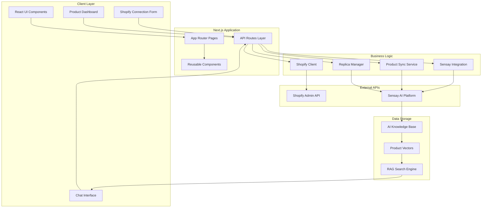

---

## 🔄 **Data Flow Architecture**

### **1. Store Connection Flow**

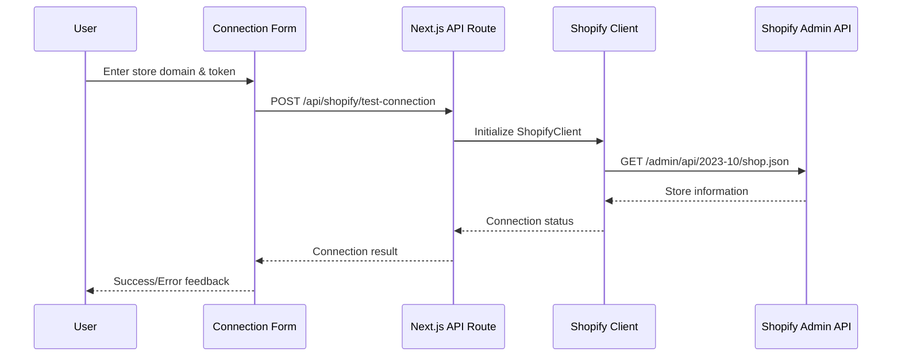

### **2. Product Synchronization Flow**

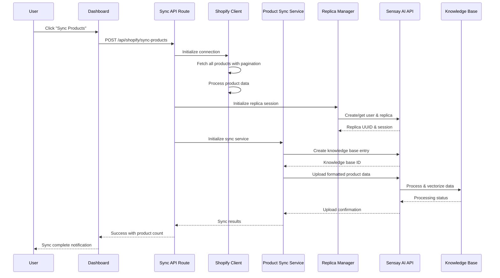

### **3. AI Chat Interaction Flow**

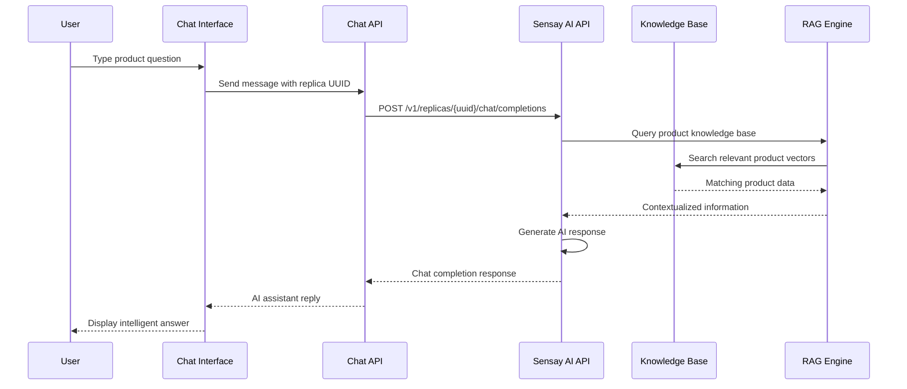

---

## 🏛️ **System Components**

### **Frontend Layer**

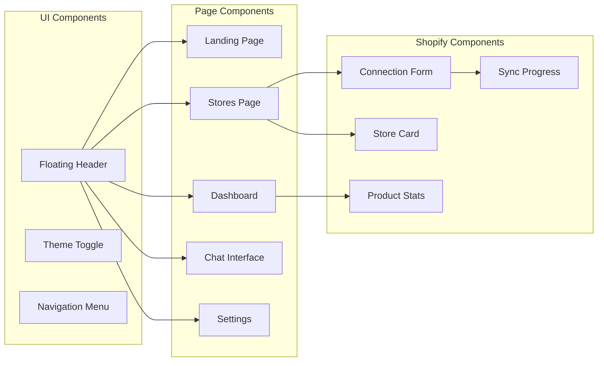

### **Backend Services**

```mermaid
graph TB
    subgraph "API Routes"
        A[/api/shopify/test-connection]
        B[/api/shopify/sync-products]
    end

    subgraph "Core Services"
        C[ShopifyClient]
        D[ProductSyncService]
        E[ReplicaManager]
    end

    subgraph "Utilities"
        F[Data Processing]
        G[Error Handling]
        H[Progress Tracking]
    end

    A --> C
    B --> C
    B --> D
    B --> E

    C --> F
    D --> G
    E --> H
```

---

## 🔗 **Integration Patterns**

### **1. Shopify Integration**

**Connection Pattern:**
- Uses Admin API with access token authentication
- Implements proper error handling for common issues (401, 403, 404)
- Supports pagination for large product catalogs
- Handles rate limiting gracefully

**Data Processing Pattern:**
```typescript
// Product data transformation pipeline
ShopifyProduct → ProcessedProduct → FormattedKnowledgeBase → AIVectors
```

### **2. Sensay AI Integration**

**Session Management Pattern:**
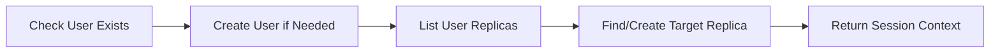

**Knowledge Base Pattern:**
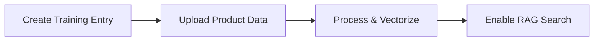

---

## 🔒 **Security Architecture**

### **Authentication & Authorization**

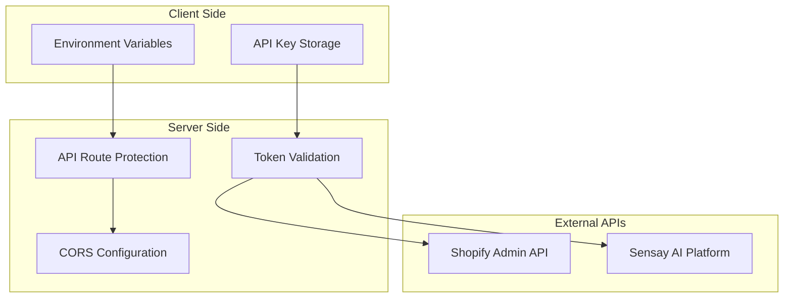

**Security Measures:**
- 🔐 Environment-based API key management
- 🛡️ Server-side API calls to prevent CORS issues
- 🔒 No sensitive data stored client-side
- ✅ Input validation with Zod schemas
- 🚫 Rate limiting and error handling

---

## 📊 **Data Models**

### **Shopify Product Model**

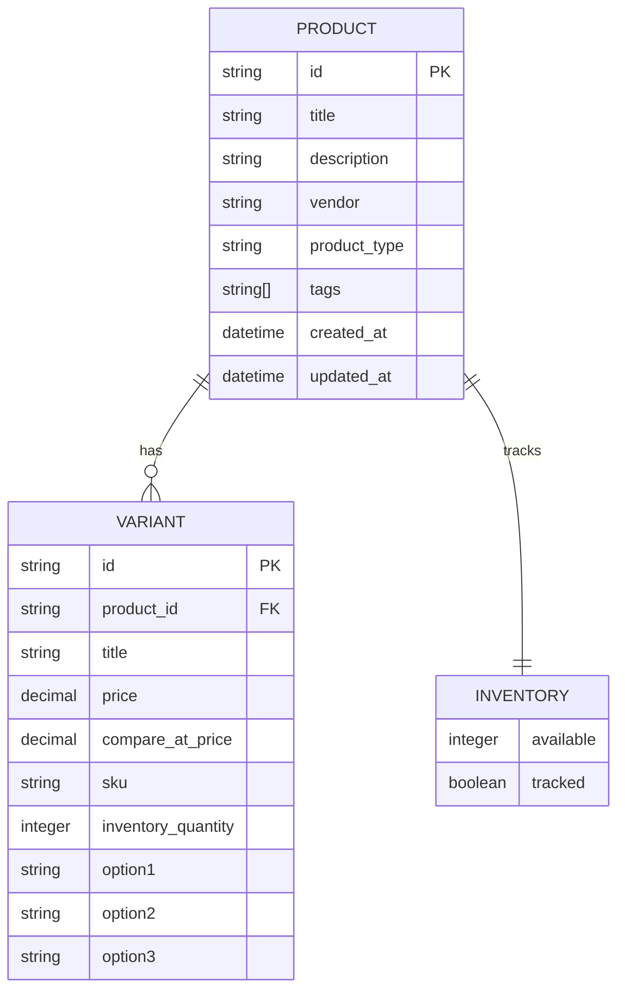

### **Processed Data Model**

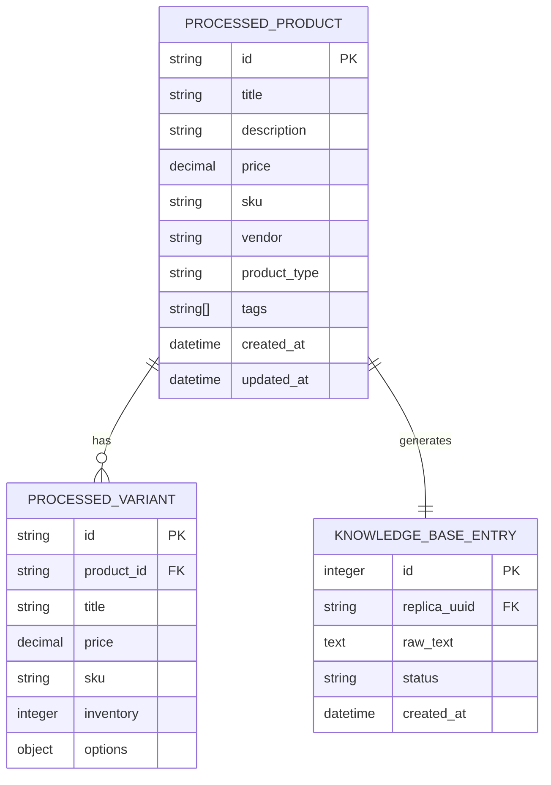

---

## 🚀 **Scalability Considerations**

### **Performance Optimizations**

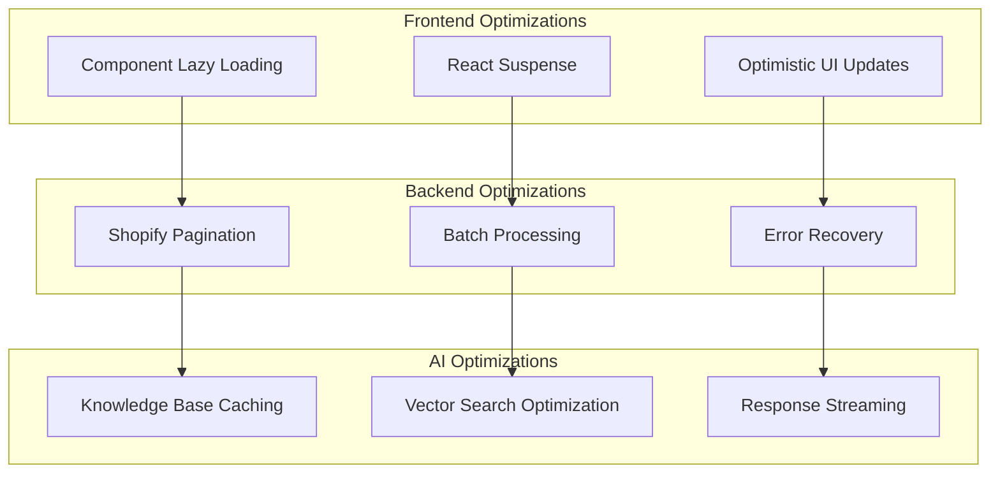

### **Scalability Patterns**

1. **Horizontal Scaling**
   - Stateless API routes
   - External service dependencies
   - Session management via Sensay

2. **Data Handling**
   - Streaming for large datasets
   - Pagination for product lists
   - Progressive loading UI

3. **Error Resilience**
   - Graceful degradation
   - Retry mechanisms
   - User feedback systems

---

## 🔄 **Deployment Architecture**

### **Development Environment**

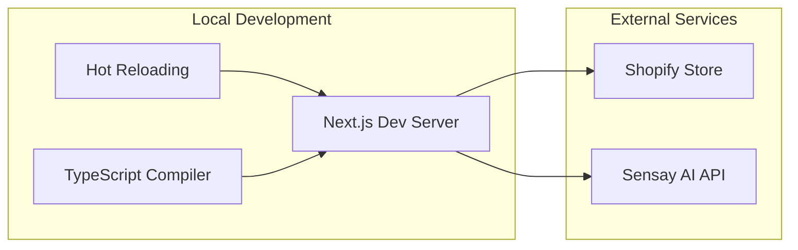

### **Production Deployment**

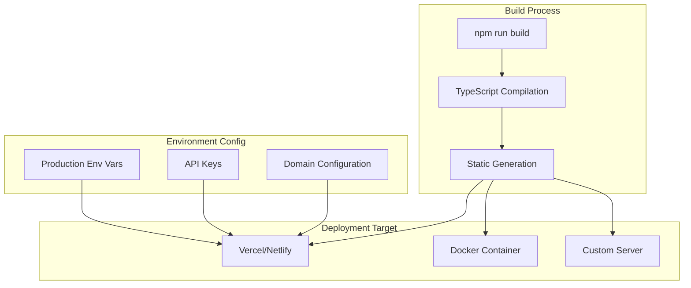

---

## 📈 **Monitoring & Analytics**

### **System Health Monitoring**

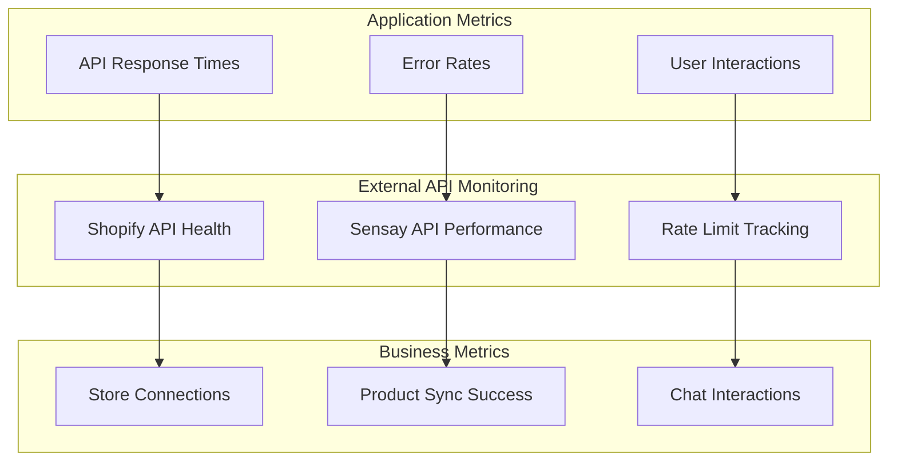

### **Logging Strategy**

- 📋 **Request/Response Logging**: API interactions
- 🐛 **Error Tracking**: Comprehensive error capture
- 📊 **Performance Metrics**: Response times and success rates
- 👤 **User Analytics**: Feature usage and engagement

---

## 🔮 **Future Architecture Enhancements**

### **Planned Improvements**

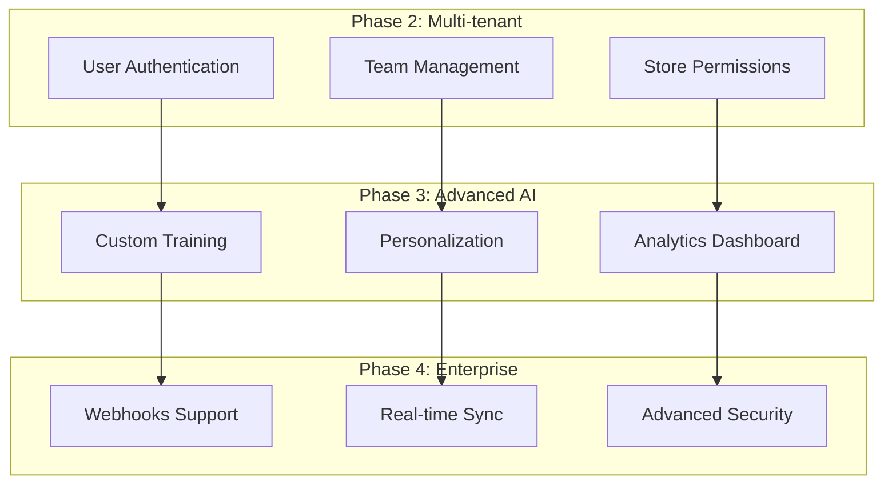

### **Technical Roadmap**

1. **Authentication System**
   - User accounts and sessions
   - Multi-store management per user
   - Role-based access control

2. **Real-time Features**
   - Shopify webhooks integration
   - Live inventory updates
   - Real-time chat notifications

3. **Advanced Analytics**
   - Customer interaction insights
   - Product performance metrics
   - AI conversation analytics

4. **Enterprise Features**
   - White-label solutions
   - Advanced security controls
   - Custom AI model training

---

*This architecture document provides a comprehensive overview of the current system implementation and future scalability considerations. For implementation details, see the [API Documentation](./API.md).*