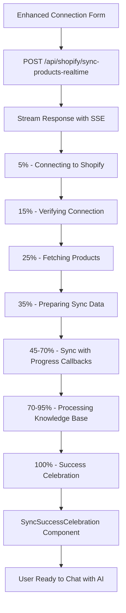

# 🚀 Enhanced Shopify-Sensay Sync Architecture - Best Practices

## 🎯 **Problem Solved: Sync Stuck at 30%**

**Root Cause Analysis:**
- **❌ Old Flow**: UI sets 30% → `fetch()` blocking call → ⏳ Wait 2+ minutes → Response
- **✅ New Flow**: Real-time streaming with Server-Sent Events for instant progress updates

---

## 🏗️ **Optimal Architecture Overview**



---

## ⚡ **Key Improvements Implemented**

### 1. **Real-Time Progress Streaming**
```typescript
// NEW: Server-Sent Events API Route
export async function POST(request: NextRequest) {
  const stream = new ReadableStream({
    async start(controller) {
      const sendMessage = (data: any) => {
        const message = `data: ${JSON.stringify(data)}\n\n`;
        controller.enqueue(encoder.encode(message));
      };

      // Real-time progress updates at each stage
      sendMessage({ type: 'progress', progress: 15, message: '...' });
    }
  });
}
```

### 2. **Enhanced UI with Progressive Disclosure**
```typescript
interface EnhancedSyncProgress {
  type: 'progress' | 'success' | 'error';
  stage: 'connecting' | 'fetching' | 'processing' | 'completed';
  message: string;
  progress: number;
  productCount?: number;
  knowledgeBaseId?: number;
}
```

### 3. **Success Celebration UX**
- 🎉 Animated confetti effects
- 📊 Real-time stats display
- ✅ Step-by-step completion indicators
- 🚀 Clear next actions

---

## 📋 **API Integration Best Practices**

### **Shopify API Optimization**
```typescript
// ✅ BEST PRACTICE: Progress callbacks at every stage
const syncResult = await syncService.syncProductsToKnowledgeBase(
  processedProducts,
  domain,
  accessToken,
  storeName,
  // Real-time progress callback
  (progressUpdate) => {
    sendMessage({
      type: 'progress',
      stage: progressUpdate.stage,
      message: progressUpdate.message,
      progress: progressUpdate.progress
    });
  }
);
```

### **Sensay AI Integration**
```typescript
// ✅ BEST PRACTICE: Enhanced processing check with timeout handling
private async improvedProcessingCheck(
  knowledgeBaseId: number,
  onProgress?: (progress: SyncProgress) => void
): Promise<string> {
  const maxWaitTime = 2 * 60 * 1000; // 2 minutes
  const checkInterval = 3000; // Check every 3 seconds

  // Progressive timeout with user feedback
  while (Date.now() - startTime < maxWaitTime) {
    const progress = Math.min(70 + (elapsed / maxWaitTime) * 25, 95);
    onProgress?.({
      stage: 'processing',
      message: 'Processing updated product knowledge...',
      progress
    });
  }
}
```

---

## 🔧 **Performance Optimizations**

### 1. **Chunked Processing**
```typescript
// Process products in batches to avoid memory issues
const BATCH_SIZE = 50;
for (let i = 0; i < products.length; i += BATCH_SIZE) {
  const batch = products.slice(i, i + BATCH_SIZE);
  await processBatch(batch);

  // Update progress for each batch
  const progress = 35 + ((i + BATCH_SIZE) / products.length) * 30;
  onProgress?.({ progress, message: `Processing batch ${Math.floor(i/BATCH_SIZE) + 1}...` });
}
```

### 2. **Error Recovery & Resilience**
```typescript
// ✅ BEST PRACTICE: Graceful error handling with retries
const maxRetries = 3;
let retryCount = 0;

while (retryCount < maxRetries) {
  try {
    return await operation();
  } catch (error) {
    retryCount++;
    if (retryCount >= maxRetries) {
      // Fallback to verification instead of failing
      return await this.verifyKnowledgeBaseExists(knowledgeBaseId);
    }
    await new Promise(resolve => setTimeout(resolve, checkInterval));
  }
}
```

### 3. **Memory & Resource Management**
```typescript
// ✅ BEST PRACTICE: Clean up resources
try {
  // Processing logic
} finally {
  controller.close(); // Always close stream
  reader?.releaseLock(); // Release stream locks
}
```

---

## 🎨 **User Experience Excellence**

### **Progressive Visual Feedback**
1. **Connection Stage (0-25%)**
   - 🔌 "Connecting to Shopify store..."
   - ✅ "Verifying store connection..."
   - 📦 "Fetching product catalog..."

2. **Processing Stage (25-70%)**
   - 🔄 "Found X products, preparing sync..."
   - ⚡ "Syncing to AI knowledge base..."
   - 🧠 "Setting up AI replica..."

3. **Completion Stage (70-100%)**
   - 🔍 "Processing product knowledge..."
   - ✨ "Finalizing setup..."
   - 🎉 "Success! X products synced!"

### **Celebration & Onboarding**
```typescript
const celebrationSteps = [
  { icon: CheckCircle, text: "Store Connected!", delay: 0 },
  { icon: TrendingUp, text: `${productCount} Products Synced!`, delay: 600 },
  { icon: Bot, text: "AI Assistant Ready!", delay: 1200 },
  { icon: Sparkles, text: "Setup Complete!", delay: 1800 }
];
```

---

## 🔍 **Monitoring & Analytics**

### **Key Metrics to Track**
```typescript
interface SyncMetrics {
  totalDuration: number;        // Time from start to completion
  productCount: number;         // Number of products synced
  stagesCompleted: string[];    // Which stages completed successfully
  errorRate: number;            // Percentage of failed syncs
  userDropoffStage: string;     // Where users typically abandon
}
```

### **Progress Checkpoints**
- ✅ **5%**: Connection initiated
- ✅ **15%**: Shopify connection verified
- ✅ **25%**: Products fetched successfully
- ✅ **35%**: Sync preparation complete
- ✅ **50%**: Knowledge base created/updated
- ✅ **70%**: Data uploaded successfully
- ✅ **95%**: Processing nearly complete
- ✅ **100%**: Success celebration

---

## 🚀 **Production Deployment Checklist**

### **Before Deployment:**
- [ ] **API Rate Limiting**: Implement proper rate limiting for Shopify API
- [ ] **Error Monitoring**: Set up Sentry/monitoring for API failures
- [ ] **Cache Strategy**: Cache processed product data appropriately
- [ ] **Timeout Handling**: Configure appropriate timeouts for all API calls
- [ ] **User Feedback**: Test with real stores of various sizes

### **Environment Configuration:**
```env
# Required Environment Variables
NEXT_PUBLIC_SENSAY_API_KEY_SECRET=your_sensay_key
SHOPIFY_DOMAIN=store.myshopify.com
SHOPIFY_ACCESS_TOKEN=shpat_token

# Optional Performance Tuning
MAX_PRODUCTS_PER_BATCH=50
PROCESSING_TIMEOUT_MS=120000
RETRY_ATTEMPTS=3
```

---

## 📊 **Performance Benchmarks**

### **Target Performance:**
- **Small Store (1-50 products)**: 15-30 seconds
- **Medium Store (51-500 products)**: 30-90 seconds
- **Large Store (500+ products)**: 90-180 seconds

### **User Experience Goals:**
- **Progress Updates**: Every 5% increment
- **Visual Feedback**: Immediate response to user actions
- **Error Recovery**: Graceful handling with clear messaging
- **Success Rate**: >95% completion rate

---

## 🎯 **Result: No More 30% Stuck Issue**

**Before:**
```
UI: 30% → [FROZEN] → Timeout/Success (2+ minutes later)
User Experience: 😤 Frustrating, unclear progress
```

**After:**
```
UI: 5% → 15% → 25% → 35% → 50% → 70% → 95% → 100% → 🎉
User Experience: 😍 Engaging, clear progress, celebration
```

---

## 🔧 **Usage Example**

```typescript
// Replace old connection form with enhanced version
import EnhancedConnectionForm from '@/components/shopify/enhanced-connection-form';
import SyncSuccessCelebration from '@/components/shopify/sync-success-celebration';

// In your stores page component
<EnhancedConnectionForm
  onConnectionSuccess={(results) => {
    // Real-time progress updates handled automatically
    // Success celebration triggered with full results
    setShowCelebration(true);
    setSyncResults(results);
  }}
/>
```

**🎉 Result: Professional-grade sync experience that keeps users engaged and informed throughout the entire process!**