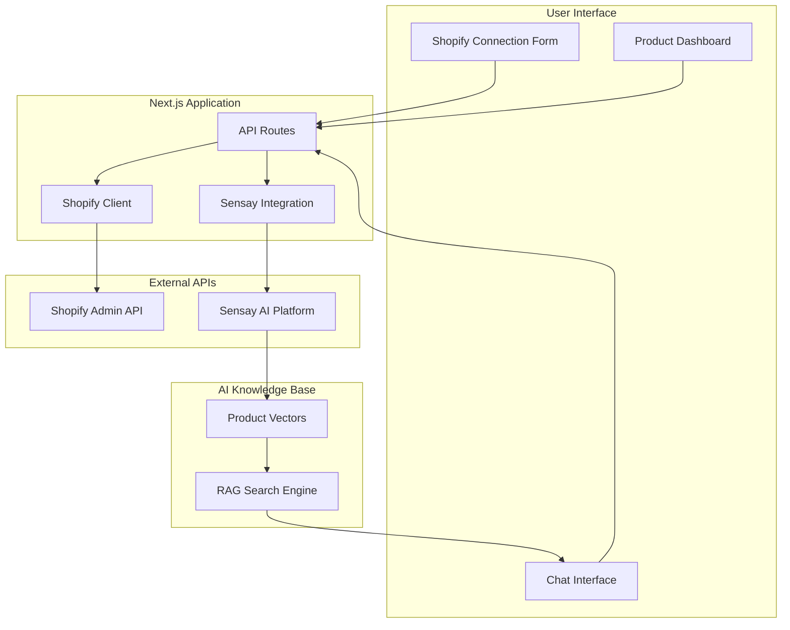

# 🛍️ Segmante - Shopify AI Agent

<div align="center">


<br/>

### **Transform your Shopify store into an intelligent AI-powered product assistant**

*Built with ❤️ using [Sensay AI](https://sensay.io) and [Shopify Admin API](https://shopify.dev/)*

<br/>


**Powered by:**


</div>

---

## 🌟 **What is Segmante?**

Segmante is a revolutionary Shopify AI Agent that bridges your Shopify store with advanced AI technology. It automatically syncs your product catalog to create an intelligent assistant that can answer customer questions, provide product recommendations, check inventory, and help with sales inquiries - all through natural conversation.

### 🎯 **Key Benefits**

- **🤖 24/7 Customer Support**: AI assistant available round-the-clock
- **📊 Real-time Inventory**: Always up-to-date stock information
- **🎯 Smart Recommendations**: AI-powered product suggestions
- **💬 Natural Conversations**: Chat naturally about products and inventory
- **⚡ Zero Setup Time**: Connect your store in minutes, not hours
- **🔄 Auto-Sync**: Products automatically synchronized with knowledge base

---

## 🚀 **Features Overview**

### 🏪 **Store Connection**
- **One-Click Integration**: Connect your Shopify store with just domain and access token
- **Secure Authentication**: Uses Shopify Admin API with proper security practices
- **Connection Validation**: Real-time testing of store credentials
- **Multiple Stores**: Support for connecting multiple Shopify stores

### 📦 **Product Intelligence**
- **Complete Catalog Sync**: Automatically imports all products, variants, and details
- **Rich Product Data**: Includes pricing, inventory, descriptions, SKUs, and categories
- **Variant Support**: Handles complex products with multiple variants (sizes, colors, etc.)
- **Inventory Tracking**: Real-time stock levels and availability status

### 🧠 **AI-Powered Assistant**
- **Natural Language Queries**: Ask questions in plain English
- **Context-Aware Responses**: Understands product relationships and customer intent
- **Advanced Search**: Find products by name, category, price range, or any attribute
- **Smart Recommendations**: Suggests related or complementary products

### 💡 **Intelligent Conversations**

**Example Interactions:**
```
👤 "What snowboards do you have in stock?"
🤖 "I have 9 snowboards currently available, ranging from $600 to $2,629..."

👤 "Do you have any products under $50?"
🤖 "Yes! I found the Sample Selling Plans Ski Wax for $9.95 and..."

👤 "Tell me about the Complete Snowboard variants"
🤖 "The Complete Snowboard comes in 5 variants: Ice, Dawn, Powder..."
```

### 📊 **Professional Dashboard**
- **Modern UI/UX**: Built with shadcn/ui components and Tailwind CSS
- **Dark/Light Theme**: Automatic theme switching with user preference
- **Responsive Design**: Works perfectly on desktop, tablet, and mobile
- **Real-time Sync Progress**: Visual feedback during product synchronization

---

## 🏗️ **System Architecture**



---

## ⚡ **Quick Start**

### 📋 **Prerequisites**

- **Node.js 18+** (v20+ recommended)
- **Shopify Store** with Admin access
- **Sensay AI API Key** ([Get yours here](https://sensay.io))

### 🛠️ **Installation**

1. **Clone the repository:**
```bash
git clone https://github.com/your-org/segmante.git
cd segmante
```

2. **Install dependencies:**
```bash
npm install
```

3. **Environment setup:**
```bash
cp .env.local.example .env.local
```

Edit `.env.local`:
```env
NEXT_PUBLIC_SENSAY_API_KEY_SECRET=your_sensay_api_key_here
```

4. **Start development server:**
```bash
npm run dev
```

5. **Open your browser:**
Navigate to [http://localhost:3000](http://localhost:3000)

### 🎉 **That's it!** You're ready to connect your Shopify store and start chatting with your AI agent.

---

## 🎮 **How to Use**

### Step 1: Connect Your Store
1. Navigate to the "Stores" tab
2. Enter your Shopify store domain (e.g., `your-store.myshopify.com`)
3. Provide your Admin API access token
4. Click "Connect Store"

### Step 2: Sync Products
1. Wait for the connection validation
2. Products will automatically sync to the AI knowledge base
3. Monitor progress with the real-time progress bar
4. Sync completes when vectorization is finished

### Step 3: Chat with Your AI
1. Go to the "Chat" tab
2. Ask questions about your products naturally:
   - "What's in stock?"
   - "Show me products under $100"
   - "Tell me about the snowboard variants"
   - "What's the most expensive item?"

### Step 4: Manage & Monitor
1. Use the Dashboard to view connected stores
2. Monitor sync status and product counts
3. Re-sync products when inventory changes
4. Manage multiple store connections

---

## 🔧 **Tech Stack**

| Category | Technology | Purpose |
|----------|------------|---------|
| **Frontend** | Next.js 14 | React framework with App Router |
| **Language** | TypeScript | Type-safe development |
| **Styling** | Tailwind CSS + shadcn/ui | Modern, responsive UI |
| **State Management** | React Hooks | Component state management |
| **HTTP Client** | Fetch API + Axios | API communication |
| **AI Platform** | Sensay AI | Knowledge base and chat completions |
| **E-commerce** | Shopify Admin API | Product data synchronization |
| **Validation** | Zod + React Hook Form | Form validation and handling |

---

## 📚 **API Integration**

### Sensay AI APIs Used:
- **Chat Completions**: `/v1/replicas/{uuid}/chat/completions`
- **Knowledge Base**: `/v1/replicas/{uuid}/training`
- **Replica Management**: `/v1/replicas`
- **User Management**: `/v1/users`

### Shopify APIs Used:
- **Products**: `/admin/api/2023-10/products.json`
- **Shop Info**: `/admin/api/2023-10/shop.json`
- **Product Count**: `/admin/api/2023-10/products/count.json`
- **Inventory**: `/admin/api/2023-10/inventory_levels.json`

---

## 🏪 **Shopify Setup Guide**

### Getting Your Store Domain & Access Token

#### 1. **Find Your Store Domain**
Your Shopify store domain follows this format:
```
your-store-name.myshopify.com
```
You can find it in your Shopify admin URL or store settings.

#### 2. **Create a Private App for API Access**

**Step-by-step instructions:**

1. **Login to Shopify Admin**
   - Go to your store's admin panel
   - Navigate to **Apps** section

2. **Manage Private Apps**
   - Click **"Apps and sales channels"** → **"Develop apps for your store"**
   - If you don't see this option, go to **Settings** → **Apps and sales channels** → **Develop apps**

3. **Create New App**
   - Click **"Create an app"**
   - Enter app name: `"AI Product Assistant"`
   - Enter developer email (your email)

4. **Configure Admin API Access**
   - Click **"Configure Admin API scopes"**
   - Enable these permissions:
     - ✅ `read_products` - Read products
     - ✅ `read_product_listings` - Read product listings
     - ✅ `read_inventory` - Read inventory levels
     - ✅ `read_locations` - Read store locations

5. **Generate Access Token**
   - Click **"Save"** to save permissions
   - Click **"Install app"**
   - Copy the **Admin API access token** (starts with `shpat_`)

#### 3. **Security Best Practices**

⚠️ **Important Security Notes:**
- **Never share your access token** publicly or commit it to version control
- **Use environment variables** to store sensitive credentials
- **Regularly rotate tokens** for enhanced security
- **Monitor API usage** in your Shopify admin

#### 4. **Testing Your Credentials**

Before using the app, verify your credentials:

```bash
curl -X GET "https://YOUR_STORE.myshopify.com/admin/api/2023-10/shop.json" \
  -H "X-Shopify-Access-Token: YOUR_ACCESS_TOKEN"
```

If successful, you'll see your shop information returned.

#### 5. **Common Issues & Solutions**

| Issue | Solution |
|-------|----------|
| **401 Unauthorized** | Check access token is correct and has proper permissions |
| **403 Forbidden** | Enable required API scopes in your private app |
| **404 Not Found** | Verify store domain is correct (include `.myshopify.com`) |
| **Rate Limiting** | Shopify has API rate limits - app handles this automatically |

---

## 🤝 **Contributing**

We welcome contributions! Please see our [Contributing Guidelines](CONTRIBUTING.md) for details.

1. Fork the repository
2. Create a feature branch (`git checkout -b feature/amazing-feature`)
3. Commit changes (`git commit -m 'Add amazing feature'`)
4. Push to branch (`git push origin feature/amazing-feature`)
5. Open a Pull Request

---

## 📝 **License**

This project is licensed under the MIT License - see the [LICENSE](LICENSE) file for details.

---

## 🔗 **Resources & Documentation**

- 📖 [Full Documentation](./docs)
- 🏗️ [Architecture Guide](./ARCHITECTURE.md)
- 🔌 [API Reference](./API.md)
- 🛍️ [Shopify Admin API](https://shopify.dev/api/admin-rest)
- 🤖 [Sensay AI Platform](https://sensay.io)
- ⚛️ [Next.js Documentation](https://nextjs.org/docs)

---

## 🆘 **Support**

- 🐛 **Issues**: [GitHub Issues](https://github.com/your-org/segmante/issues)
- 💬 **Discussions**: [GitHub Discussions](https://github.com/your-org/segmante/discussions)
- 📧 **Email**: support@segmante.com
- 📚 **Documentation**: [docs.segmante.com](https://docs.segmante.com)

---

<div align="center">

### **Ready to transform your Shopify store with AI?**

**[🚀 Get Started Now](#-quick-start) | [📖 View Documentation](./docs) | [🤝 Join Community](https://github.com/your-org/segmante/discussions)**

---

*Built with ❤️ by developers, for developers*

**[⭐ Star this repo](https://github.com/your-org/segmante) if you find it helpful!**

</div>